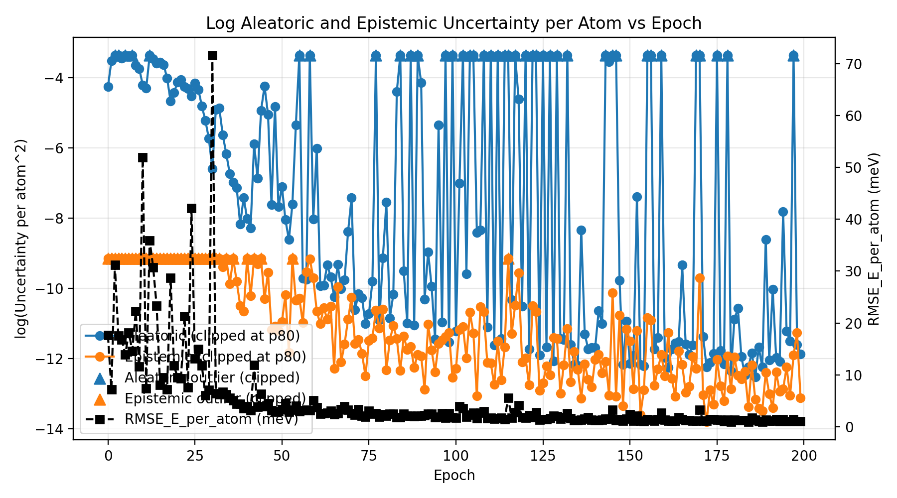
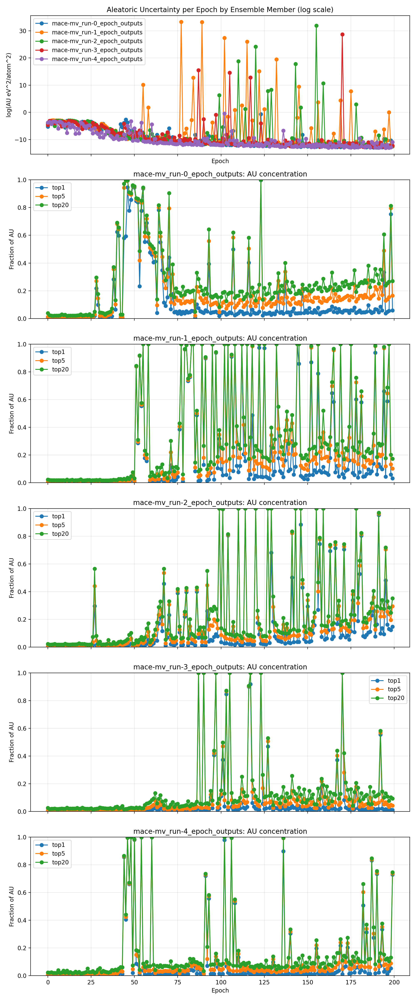
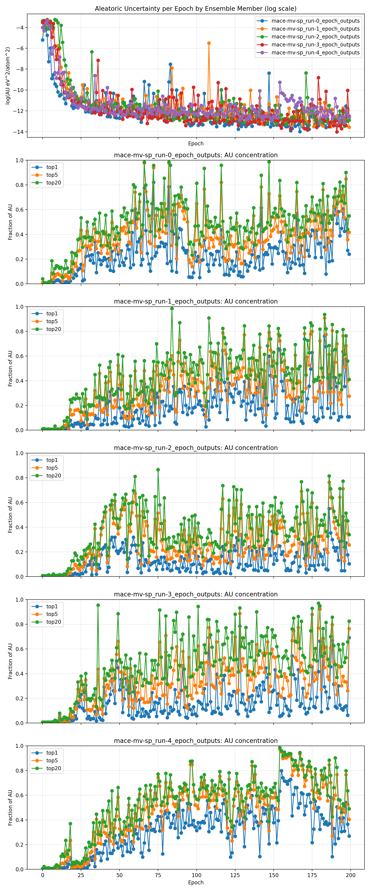
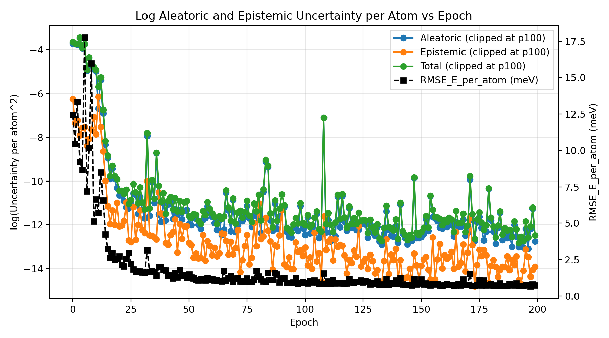
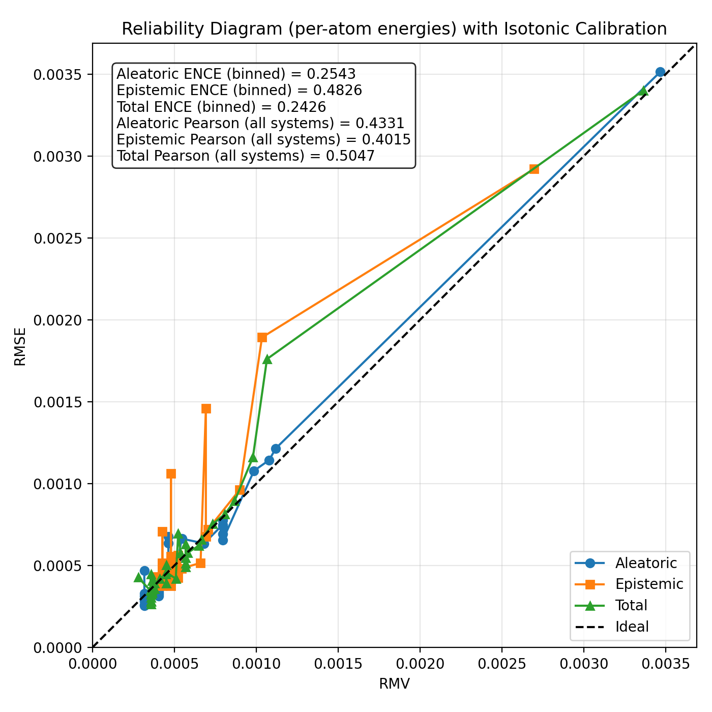
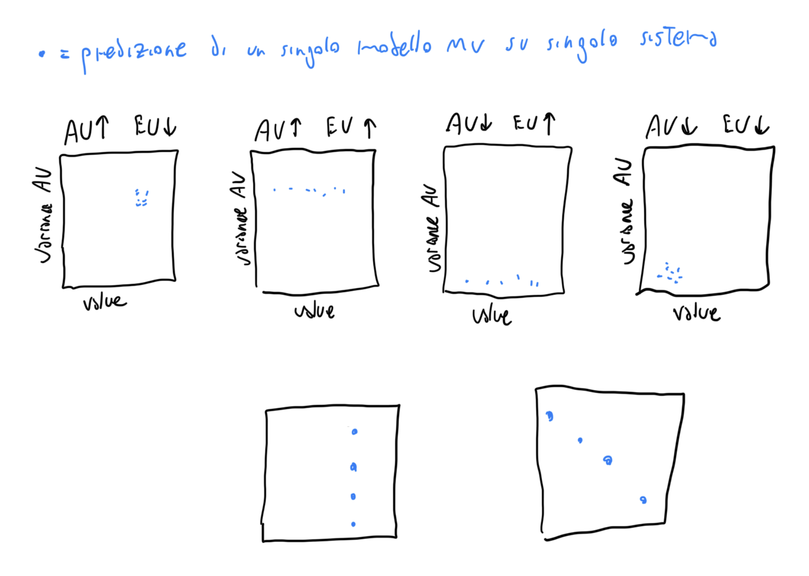
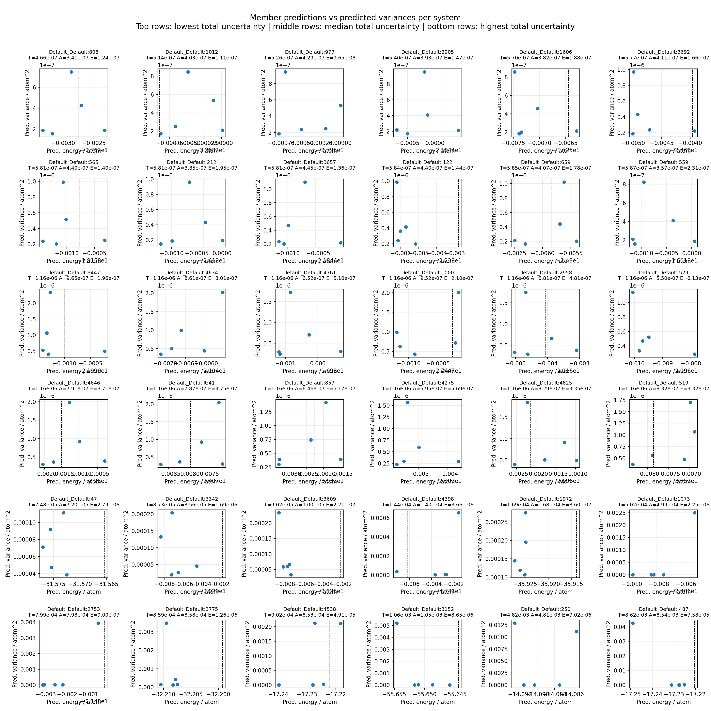

## Evoluzione di AU, EU durante il training

### AU, EU ed errore durante il training con standard mean-variance ensemble (logvar predictor)

### Analisi per ensemble member: gli spikes sono dati principalmente dai singoli membri e dalle singole configurazioni.

### Con sofplus i risultati migliorano ma forse serve aggiungere clipping o altro.

### Di conseguenza anche la media delle AU migliora

### Il reliability diagram del best model (selezionato come miglior errore su validation con ensemble) va bene (ma non benissimo)

### Singoli sistemi

### Prime due righe: minore incertezza totale, seconde due righe: media incertezza totale, terza riga: maggiore incertezza totale.

### task

- System‑OOD (nuovi sistemi)

- Energy‑OOD (stessi sistemi, energia diversa)

### 2 regimi di training

- Train/test semplice (single‑fidelity)

- Pretrain -> Fine‑tune (multi‑fidelity): Pretrain su livello low‑fidelity (DFT) grande. Fine‑tune su high‑fidelity (CC) piccolo (e calibration eventualmente).