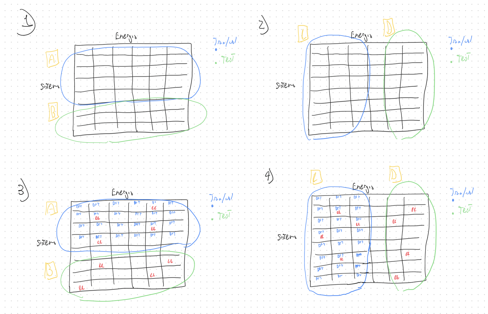

## Evoluzione di AU, EU durante il training

### AU, EU ed errore durante il training con standard mean-variance ensemble (logvar predictor)

### Analisi per ensemble member: gli spikes sono dati principalmente dai singoli membri e dalle singole configurazioni.

### Con sofplus i risultati migliorano ma forse serve aggiungere clipping o altro.

### Di conseguenza anche la media delle AU migliora

## Valutazione del best model

### Il reliability diagram del best model (selezionato come miglior errore su validation con ensemble) va bene (ma non benissimo)

### Singoli sistemi

### Prime due righe: minore incertezza totale, seconde due righe: media incertezza totale, terza riga: maggiore incertezza totale.

## Experimental setup

### Architettura per multi-fidelity

- Per ora solo pre-train fine-tune

- No multi-head

### Test setting

- System‑OOD (nuovi sistemi)

- Energy‑OOD (stessi sistemi, energia diversa)

### Regimi di training

- Train/test semplice (single‑fidelity)

- Pretrain -> Fine‑tune (multi‑fidelity): Pretrain su livello low‑fidelity (DFT) grande. Fine‑tune su high‑fidelity (CC) piccolo (e calibration eventualmente).

### Esperimenti

**Esperimento 1:** Train su dft, test su dft con sistemi nuovi

**Esperimento 2:** Train su dft, test su dft con stessi sistemi ma energia diversa

**Esperimento 3:** Pretrain su dft, fine-tune su cc (subset di dft), test su cc con sistemi nuovi

**Esperimento 4:** Pretrain su dft, fine-tune su cc (subset di dft), test su cc con stessi sistemi ma energia diversa

Lasciare spazio tra C e D? L'ordine dato da DFT e CC può cambiare?

## Dataset ANI

### Energie:

- **ccsd(t)_cbs.energy**

- hf_dz.energy, hf_tz.energy, hf_qz.energy. 

- mp2_dz.corr_energy, mp2_tz.corr_energy, mp2_qz.corr_energy. EMP2​=EHF​+EcorrMP2​

- npno_ccsd(t)_dz.corr_energy, npno_ccsd(t)_tz.corr_energy, tpno_ccsd(t)_dz.corr_energy. E≈EHF​+EcorrCCSD(T)approx

- wb97x_dz.energy, **wb97x_tz.energy**

